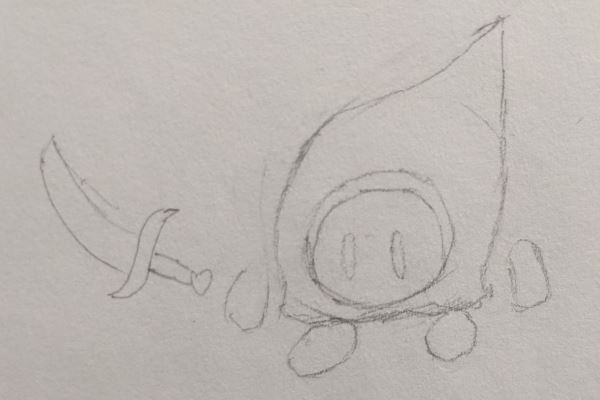

<!DOCTYPE html>
<html>

<head>

<meta charset="UTF-8">
<title>JLB Resume Site</title>

</head>

<!-- *****BEGIN MAIN BODY***** -->

<body>

<!--<b>JOHN L. BARVENIK</b> -->
 <b>JOHN L. BARVENIK</b> 
Catonsville, MD 
(443)-900-8131  |  jbarvenik@gmail.com

<!-- Begin Nav Bar section -->

<ul id="nav">
	<li id="navList"><a href="index.md" id="navLink" >Home</a></li>
	<li id="navList"><a href="resumePage.md" id="navLink">Resume</a></li>
	<li id="navList"><a href="portfolioPage.md" id="navLink">Portfolio</a></li>
	<li id="navList"><a href="videosPage.md" id="navLink" class="active">Art/Videos</a></li>
</ul>

This page showcases the progress for my game "A Grim Day Out". There is a combination of finished content and concept work.

 

This video shows the full gameplay for A Grim Day Out in its current state.

 

<iframe width="560" height="315" src="https://www.youtube.com/embed/h4xEQmrX4O8" frameborder="0" allow="accelerometer; autoplay; encrypted-media; gyroscope; picture-in-picture" allowfullscreen></iframe>
 

This video is an animation demo of both used and currently unimplemented animations for the player character.

 

<iframe width="560" height="315" src="https://www.youtube.com/embed/FCDpmNUAMLo" frameborder="0" allow="accelerometer; autoplay; encrypted-media; gyroscope; picture-in-picture" allowfullscreen></iframe>

 

<!-- Begin Art section -->

These are concept works for creatures and enemies that are not yet implemented. Due to the simple aesthetics of the game, they didn't need much revision before being modeled.
 
One of the future game mechanics is picking up and throwing objects (including the boxes and barrels seen through the level). This would also extend to enemies and creatures that are knocked over.

 

	</img>
	
Original Sketch for a bird creature.

	</img>
	
Original Sketch for a bandit enemy.

	</img>
	
Original Sketch for a crab creature.

	</img>
	
Original Sketch for a floating wizard enemy.

	</img>
	
A work in progress bird model.

	</img>
	
A work in progress bandit model.

	</img>
	
A work in progress crab model.

	</img>
	
A work in progress wizard model.

 

<!-- VIDEOS -->

	<iframe width="560" height="315" src="https://www.youtube.com/embed/yBH_koyTpRo" frameborder="0" allow="accelerometer; autoplay; encrypted-media; gyroscope; picture-in-picture" allowfullscreen></iframe>
	
Early bird animations. In addition to hopping and flying, it has a "hit" animation where it gets partially flattened. This would be used if an object were thrown at it.

	<iframe width="560" height="315" src="https://www.youtube.com/embed/xQlgc-zFqIs" frameborder="0" allow="accelerometer; autoplay; encrypted-media; gyroscope; picture-in-picture" allowfullscreen></iframe>
	
Early bandit animations. He features an arm swinging attack as well as a dive. He also has "hit" animations and an idle animation for when he is knocked on his back.

	<iframe width="560" height="315" src="https://www.youtube.com/embed/nUos3AsHW4k" frameborder="0" allow="accelerometer; autoplay; encrypted-media; gyroscope; picture-in-picture" allowfullscreen></iframe>
	
Early crab animations. As it was developed more recently, it doesn't have many finished animations. In the final version it will also be able to get hit and flipped over to be picked up by the player.

	<iframe width="560" height="315" src="https://www.youtube.com/embed/Nd9OYUd1GeI" frameborder="0" allow="accelerometer; autoplay; encrypted-media; gyroscope; picture-in-picture" allowfullscreen></iframe>
	
Early wizard animations. This enemy will not need as many animations as it couldn't be knocked over. Instead it will hover above the ground, cast magic, and only die if hit by a thrown object.

</body>

</html>
